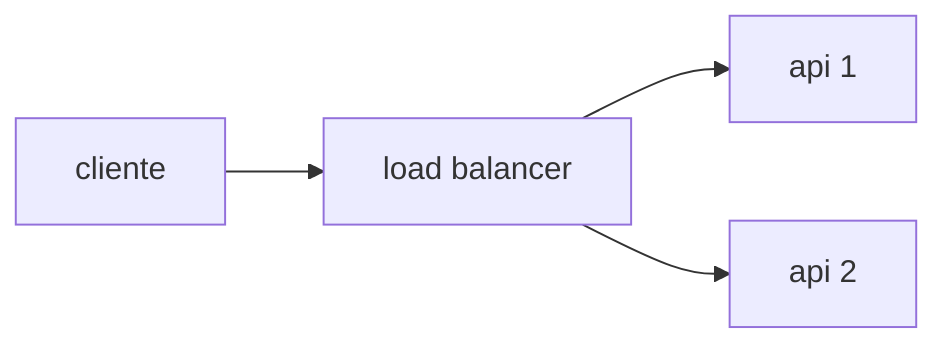

# Arquitetura e restrições

## Topologia

A sua solução deve ter pelo menos **um load balancer e duas instâncias de API**. Você pode usar banco de dados, middleware, mais instâncias ou o que achar necessário. O essencial é ter um load balancer distribuindo carga de forma igual (round-robin simples) entre **pelo menos** duas instâncias de API.



**Importante**: o seu load balancer não pode aplicar lógica de negócio — ele não pode inspecionar o payload, decidir por condicionais, responder à requisição antes de repassá-la, nem transformar o corpo da mensagem. Ele só distribui requisições entre as instâncias.

## Conteinerização

A sua solução deve ser entregue como um arquivo `docker-compose.yml`. Todas as imagens declaradas nele devem estar publicamente disponíveis.

A soma dos limites de recursos de todos os serviços declarados no `docker-compose.yml` deve ser de, no máximo, **1 CPU e 350 MB de memória**. Você distribui esse total entre os serviços como preferir. Exemplo de como declarar o limite de um serviço:

```yml
services:
  seu-servico:
    ...
    deploy:
      resources:
        limits:
          cpus: "0.15"
          memory: "42MB"
```

A entrega deve estar na branch `submission` do seu repositório, conforme [descrito aqui](./SUBMISSAO.md).

## A porta 9999

A sua solução deve responder na porta **9999** — ou seja, o load balancer é quem recebe as requisições nessa porta.

## Outras restrições

- As imagens devem ser compatíveis com `linux-amd64` (atenção especial para quem usa Mac com processadores ARM64 — [referência](https://docs.docker.com/build/building/multi-platform/)).
- O modo de rede deve ser `bridge`. O modo `host` não é permitido.
- O modo `privileged` não é permitido.
