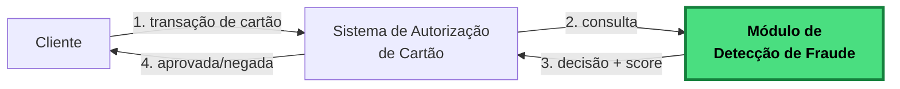

# Rinha de Backend 2026 – Detecção de fraude por busca vetorial!

**Atenção!** Esta edição ainda não tem data de término definida!

## O desafio

Construir uma API de **detecção de fraude em transações de cartão usando busca vetorial**. Para cada transação recebida, você transforma o payload em um vetor, busca no dataset de referência as transações mais parecidas e decide se aprova ou nega.



Você deve implementar apenas o módulo em verde – o sistema de autorização do cartão não faz parte do desafio.

## O que a sua API deve expor

A sua API deve expor dois endpoints na porta `9999`:

- `GET /ready` — deve responder `2xx` quando sua API estiver pronta para receber requisições.
- `POST /fraud-score` — deve receber os dados da transação e devolver a sua decisão.

Exemplo de requisição e resposta:

```
POST /fraud-score

Request:
{
  "id": "tx-123",
  "transaction": { "amount": 384.88, "installments": 3, "requested_at": "..." },
  "customer":    { "avg_amount": 769.76, "tx_count_24h": 3, "known_merchants": [...] },
  "merchant":    { "id": "MERC-001", "mcc": "5912", "avg_amount": 298.95 },
  "terminal":    { "is_online": false, "card_present": true, "km_from_home": 13.7 },
  "last_transaction": { "timestamp": "...", "km_from_current": 18.8 }
}

Response:
{ "approved": false, "fraud_score": 0.8 }
```

O contrato completo dos campos está em [API.md](./API.md).

## Como decidir aprovar ou negar

Para cada transação, a sua API deve:

1. Transformar o payload em um vetor de 14 dimensões, seguindo as fórmulas de normalização.
2. Buscar, no dataset de referência, os 5 vetores mais próximos.
3. Calcular `fraud_score = número_de_fraudes_entre_os_5 / 5`.
4. Responder com `approved = fraud_score < 0.6` e o `fraud_score` no JSON.

As 14 dimensões, as fórmulas de normalização e as constantes estão em [REGRAS_DE_DETECCAO.md](./REGRAS_DE_DETECCAO.md). Se você nunca trabalhou com busca vetorial, comece por [BUSCA_VETORIAL.md](./BUSCA_VETORIAL.md).

> **Importante!** Não é permitido usar os payloads do teste como referência ou para fazer lookup de fraudes! Os testes finais vão usar outros payloads, e fazer isso nas prévias distroce o resultado e desanima outros participantes.

## Arquivos de referência

Você recebe três arquivos. Eles não mudam durante o teste, então você pode (e deveria) pré-processá-los no build ou no startup do container.

- `references.json.gz` — 3.000.000 vetores rotulados como `fraud` ou `legit`.
- `mcc_risk.json` — risco por categoria de comerciante.
- `normalization.json` — constantes usadas na normalização.

Detalhes em [DATASET.md](./DATASET.md).

## Restrições de infraestrutura

- A sua solução deve ter pelo menos um load balancer e duas instâncias da sua API, distribuindo carga em round-robin.
- O load balancer não pode aplicar lógica de detecção — ele só distribui requisições.
- A sua submissão deve ser um `docker-compose.yml` com imagens públicas compatíveis com `linux-amd64`.
- A soma dos limites de todos os seus serviços não pode passar de 1 CPU e 350 MB de memória.
- O modo de rede deve ser `bridge`. Modo `host` e `privileged` não são permitidos.
- A sua aplicação deve responder na porta `9999`.

Detalhes em [ARQUITETURA.md](./ARQUITETURA.md).

## Pontuação

A sua pontuação final é a soma de dois componentes independentes: latência e qualidade de detecção. Cada um vai de -3000 a +3000, então o total varia de -6000 a +6000.

- **Latência (`score_p99`)** — calculada a partir do p99 observado. Cada 10x de melhoria vale +1000 pontos. Satura em +3000 quando o seu p99 é de 1 ms ou menos. Fixa em -3000 se o seu p99 passar de 2000 ms.
- **Detecção (`score_det`)** — combina uma taxa de erro ponderada (falsos positivos, falsos negativos e erros HTTP) com uma penalidade absoluta. Erros HTTP pesam mais que falsos negativos, que pesam mais que falsos positivos. Se a sua taxa de falhas passar de 15%, o score é fixado em -3000.

A fórmula completa, os pesos e exemplos de pontuação estão em [AVALIACAO.md](./AVALIACAO.md).

## Submissão

Para participar, você deve abrir um pull request adicionando um arquivo JSON em [participants/](../../participants) com o nome do seu usuário do GitHub. O arquivo lista os seus repositórios submetidos.

O seu repositório deve ter duas branches:

- `main` — o código-fonte.
- `submission` — apenas os arquivos necessários para rodar o teste, incluindo o `docker-compose.yml` na raiz.

Para rodar o teste oficial, você deve abrir uma issue com `rinha/test` na descrição. A engine da Rinha executa o teste, comenta o resultado e fecha a issue.

Passo a passo em [SUBMISSAO.md](./SUBMISSAO.md).

## Ambiente de teste

Mac Mini Late 2014, 2.6 GHz, 8 GB de RAM, Ubuntu 24.04.

## Dúvidas frequentes

Perguntas recorrentes e armadilhas comuns em [FAQ.md](./FAQ.md).

---

## Roteiro de leitura

Aqui está uma sugestão de ordem para leitura da documentação da edição desse ano.

### 1. O que você precisa construir

- **[API.md](./API.md)** — Contrato da API que precisa ser construída (`POST /fraud-score`, `GET /ready`).
- **[ARQUITETURA.md](./ARQUITETURA.md)** — Limites de CPU/memória, arquitetura mímina, conteineriezação.

### 2. Como funciona a detecção de fraude

- **[REGRAS_DE_DETECCAO.md](./REGRAS_DE_DETECCAO.md)** — **As regras que definem a detecção de fraude**: as 14 dimensões do vetor, fórmulas de normalização, como cada campo do payload deve ser tratado para a busca vetorial e exemplos completos do fluxo. *A especificação do que você precisa implementar.*
- **[BUSCA_VETORIAL.md](./BUSCA_VETORIAL.md)** — O que é uma busca vetorial, com exemplos passo-a-passo. *Essencial se você nunca trabalhou com vetores.*

### 3. Os dados

- **[DATASET.md](./DATASET.md)** — Formato dos arquivos de referência (`references.json.gz`, `mcc_risk.json`, `normalization.json`).

### 4. Participação e avaliação

- **[SUBMISSAO.md](./SUBMISSAO.md)** — Passo-a-passo do PR, branches (`main` e `submission`), como abrir a issue `rinha/test`.
- **[AVALIACAO.md](./AVALIACAO.md)** — Fórmula de pontuação, peso de falso positivo/falso negativo/erro, multiplicador de latência, como rodar o teste local.
- **[FAQ.md](./FAQ.md)** — Dúvidas recorrentes, armadilhas comuns, o que pode e não pode.

---
## Pontos em aberto
- Definição de datas de encerramento para submissões e resultados finais

---

[← README principal](../../README.md)
