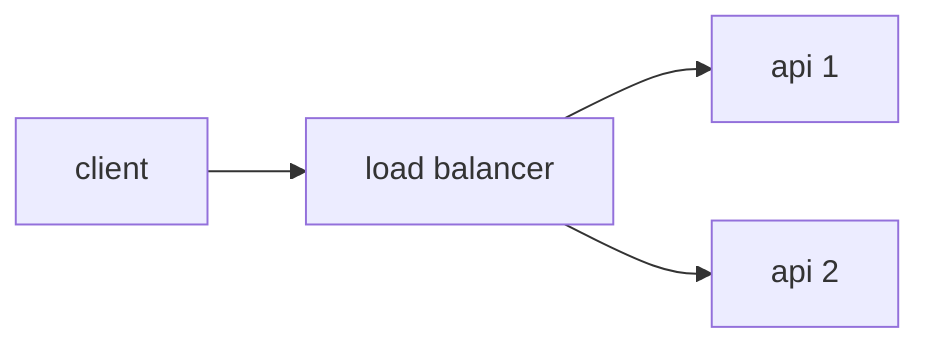

# Architecture and constraints

## Topology

Your solution must have **at least one load balancer and two web API instances**. You may or may not use a database, middleware, additional API instances, and so on. What matters is having a load balancer distributing traffic evenly (simple round-robin) across **at least** two API instances.



**Important**: your load balancer must not process requests from a business-logic perspective — it cannot inspect the payload, apply conditionals, or respond to HTTP requests before forwarding them to the upstream servers. Its job is to forward traffic, nothing more.

## Containerization

Your solution must be available as a docker compose declaration. Every image declared in `docker-compose.yml` must be publicly available.

CPU and memory usage must be limited to **1 CPU unit and 350MB of memory** across all services declared in `docker-compose.yml`. The sum of all resource limits must respect this total, and you are free to distribute it however you prefer. Example of how to declare the limits:

```YML
services:
  your-service:
    ...
    deploy:
      resources:
        limits:
          cpus: "0.15"
          memory: "42MB"
```

The containerization must be available on the `submission` branch, as [described here](./SUBMISSION.md).

## Port 9999

Your solution must respond on port **9999** — that is, your load balancer must accept requests on this port.

## Other constraints

- Images must be compatible with linux-amd64 (this matters especially if you use a Mac with an ARM64 processor — [reference](https://docs.docker.com/build/building/multi-platform/)).
- Network mode must be `bridge`. `host` mode is not allowed.
- `privileged` mode is not allowed.
