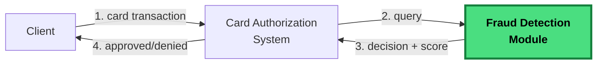

# Rinha de Backend 2026 – Fraud detection via vector search!

**Heads up!** This edition does not have a defined end date yet!

## The challenge

Build a **fraud detection API for card transactions using vector search**. For each incoming transaction, you transform the payload into a vector, search the reference dataset for the most similar transactions and decide whether to approve or deny it.



You only implement the module highlighted in green — the card authorization system is not part of the challenge.

## What your API must expose

Your API must expose two endpoints on port `9999`:

- `GET /ready` — must respond `2xx` when your API is ready to receive requests.
- `POST /fraud-score` — must receive the transaction data and return your decision.

Example request and response:

```
POST /fraud-score

Request:
{
  "id": "tx-123",
  "transaction": { "amount": 384.88, "installments": 3, "requested_at": "..." },
  "customer":    { "avg_amount": 769.76, "tx_count_24h": 3, "known_merchants": [...] },
  "merchant":    { "id": "MERC-001", "mcc": "5912", "avg_amount": 298.95 },
  "terminal":    { "is_online": false, "card_present": true, "km_from_home": 13.7 },
  "last_transaction": { "timestamp": "...", "km_from_current": 18.8 }
}

Response:
{ "approved": false, "fraud_score": 0.8 }
```

The full field contract is in [API.md](./API.md).

## How to decide approve or deny

For each transaction, your API must:

1. Transform the payload into a 14-dimensional vector, following the normalization formulas.
2. Search, in the reference dataset, for the 5 nearest vectors.
3. Compute `fraud_score = number_of_frauds_among_the_5 / 5`.
4. Respond with `approved = fraud_score < 0.6` and the `fraud_score` in the JSON.

The 14 dimensions, the normalization formulas and the constants are in [DETECTION_RULES.md](./DETECTION_RULES.md). If you have never worked with vector search, start with [VECTOR_SEARCH.md](./VECTOR_SEARCH.md).

> **Important!** Using the test payloads as a reference or for fraud lookup is not allowed! The final tests will use different payloads, and doing this in the previews distorts the results and discourages other participants.

## Reference files

You receive three files. They don't change during the test, so you can (and should) pre-process them at build time or at container startup.

- `references.json.gz` — 3,000,000 vectors labeled as `fraud` or `legit`.
- `mcc_risk.json` — risk by merchant category.
- `normalization.json` — constants used in normalization.

Details in [DATASET.md](./DATASET.md).

## Infrastructure constraints

- Your solution must have at least one load balancer and two instances of your API, distributing load in round-robin.
- The load balancer must not apply detection logic — it only distributes requests.
- Your submission must be a `docker-compose.yml` with public images compatible with `linux-amd64`.
- The sum of the limits of all your services must not exceed 1 CPU and 350 MB of memory.
- Network mode must be `bridge`. `host` and `privileged` modes are not allowed.
- Your application must respond on port `9999`.

Details in [ARCHITECTURE.md](./ARCHITECTURE.md).

## Scoring

Your final score is the sum of two independent components: latency and detection quality. Each ranges from -3000 to +3000, so the total ranges from -6000 to +6000.

- **Latency (`score_p99`)** — computed from the observed p99. Each 10x improvement is worth +1000 points. Saturates at +3000 when your p99 is 1 ms or lower. Fixed at -3000 if your p99 exceeds 2000 ms.
- **Detection (`score_det`)** — combines a weighted error rate (false positives, false negatives and HTTP errors) with an absolute penalty. HTTP errors weigh more than false negatives, which weigh more than false positives. If your failure rate exceeds 15%, the score is fixed at -3000.

The full formula, weights and scoring examples are in [EVALUATION.md](./EVALUATION.md).

## Submission

To participate, you must open a pull request adding a JSON file in [participants/](../../participants) named after your GitHub username. The file lists your submitted repositories.

Your repository must have two branches:

- `main` — the source code.
- `submission` — only the files needed to run the test, including the `docker-compose.yml` at the root.

To run the official test, you must open an issue with `rinha/test` in the description. The Rinha engine runs the test, posts the result as a comment and closes the issue.

Step-by-step in [SUBMISSION.md](./SUBMISSION.md).

## Test environment

Mac Mini Late 2014, 2.6 GHz, 8 GB RAM, Ubuntu 24.04.

## Frequently asked questions

Recurring questions and common pitfalls in [FAQ.md](./FAQ.md).

---

## Reading roadmap

Here's a suggested reading order for this year's documentation.

### 1. What you need to build

- **[API.md](./API.md)** — The API contract you need to build (`POST /fraud-score`, `GET /ready`).
- **[ARCHITECTURE.md](./ARCHITECTURE.md)** — CPU/memory limits, minimum architecture, containerization.

### 2. How fraud detection works

- **[DETECTION_RULES.md](./DETECTION_RULES.md)** — **The rules that define fraud detection**: the 14 vector dimensions, normalization formulas, how each payload field should be handled for the vector search, and complete flow examples. *The specification of what you need to implement.*
- **[VECTOR_SEARCH.md](./VECTOR_SEARCH.md)** — What a vector search is, with step-by-step examples. *Essential if you've never worked with vectors.*

### 3. The data

- **[DATASET.md](./DATASET.md)** — Format of the reference files (`references.json.gz`, `mcc_risk.json`, `normalization.json`).

### 4. Participation and evaluation

- **[SUBMISSION.md](./SUBMISSION.md)** — Step-by-step PR guide, branches (`main` and `submission`), how to open the `rinha/test` issue.
- **[EVALUATION.md](./EVALUATION.md)** — Scoring formula, false positive/false negative/error weights, latency multiplier, how to run the test locally.
- **[FAQ.md](./FAQ.md)** — Frequently asked questions, common pitfalls, what's allowed and what isn't.

---
## Open points
- Definition of deadlines for submissions and final results

---

[← Main README](../../README.md)
